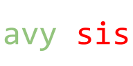

 [beta]

Avysis is a small antivirus built with PowerShell. It uses the [URLHaus API](https://urlhaus-api.abuse.ch/), which is really useful (doesn't use a key, no rate-limit). It's only recommended for systems that don't support Windows Defender (like the recent tiny10 builds).

## How to install

Currently, the installation process is to go to the releases tab and download the EXE. Then run it.

### Compile yourself

#### Quick compile

You need ps2exe and Inno Setup (in path).
```powershell
git clone https://github.com/avysis/avysis.git; cd avysis; .\build
```

#### Normal compile

You need ps2exe and Inno Setup (in path). Then run build.cmd.

#### Install

Run the setup EXE.
